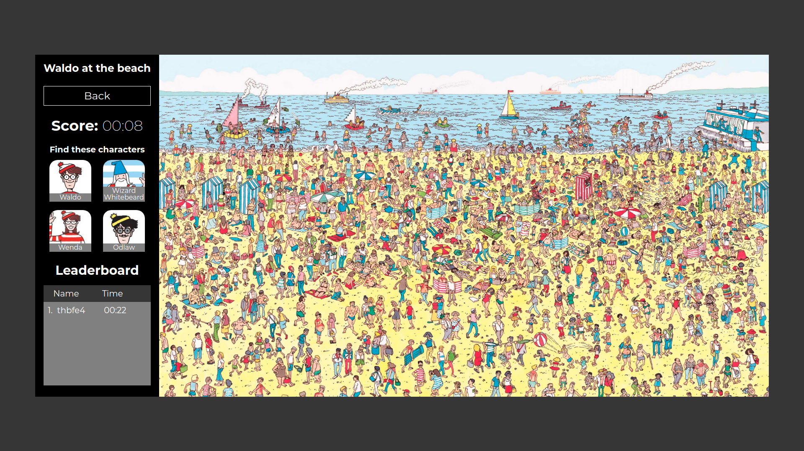

The purpose of this project was to practice my Javascript and Rails skills.

Visit this project live at: https://odin-wheres-waldo-app.herokuapp.com/

OR

Run the project locally (prerequisites: ruby 2.6.5, rails 6.0.3.4):

1. Download or clone the repository.
2. Open the terminal inside the root of the project and run:
3. bundle install
4. rails db:create
5. rails db:migrate
6. rails db:seed
7. rails s
8. In your internet browser visit localhost:3000